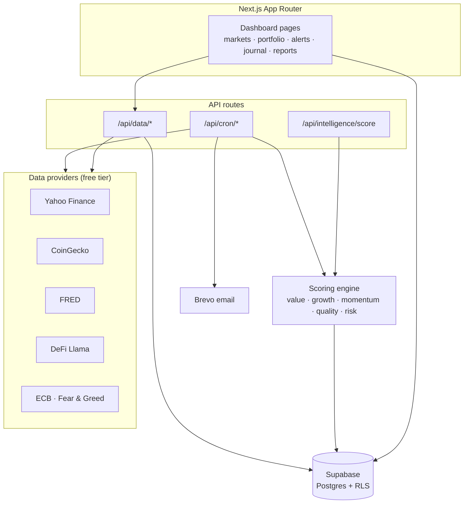

# Wealth Intel

> **One dashboard for every market. Real data, quantitative scoring, zero spreadsheets.**

Wealth Intel is a unified investment intelligence dashboard — it pulls live data across equities, crypto, forex, commodities and macro, scores every asset with a transparent quantitative engine, and tracks your portfolio with risk, correlation and tax analytics. It replaces a stack of 11 chatbot "gems" and custom GPTs with a single, auditable Next.js app.

[](https://github.com/Franck1120/wealth-intel/actions/workflows/ci.yml)
[](https://nextjs.org)
[](https://www.typescriptlang.org)
[](https://supabase.com)
[](LICENSE)
[](https://github.com/Franck1120/wealth-intel/stargazers)

> **Status:** `v0.1.0` — core dashboard, scoring engine and data providers are real and tested.
> Live market data flows through free-tier APIs; no paid keys required to run.

---

## Demo

<!-- TODO: replace with real screen recordings -->
| Markets overview | Asset scoring | Portfolio analytics |
|------------------|---------------|---------------------|
|  |  |  |

> _GIFs are placeholders — drop real recordings into `docs/demo/` to light them up._

---

## What it does

```
 EQUITIES   CRYPTO   FOREX   COMMODITIES   MACRO
     │        │        │          │          │
     └────────┴────────┼──────────┴──────────┘
                       ▼
              ┌─────────────────┐
              │  Scoring engine │   value · growth · momentum · quality · risk
              └────────┬────────┘
                       ▼
        Opportunities · Alerts · Journal · Reports
                       ▼
        Portfolio: P&L · risk · correlation · IT tax
```

- **📈 Multi-market coverage** — equities, crypto, forex, commodities and macro in one place
- **🧮 Quantitative scoring** — a 5-factor engine (value, growth, momentum, quality, risk) ranks every asset, with per-asset-class adapters
- **🤖 AI scoring layer** — optional LLM pass for qualitative context on top of the quant score
- **💼 Portfolio tracking** — positions, P&L, risk metrics, correlation matrix and Italian capital-gains tax estimation
- **🔔 Alerts & journal** — price/score alerts plus a trading journal for decision logging
- **🗞 Automated reports** — scheduled weekly reports via cron + email (Brevo)
- **🔐 Auth & RLS** — Supabase auth with Row Level Security on every table
- **⚙️ Background jobs** — cron routes for price refresh, macro refresh, batch scoring and alert checks

---

## Tech stack

| Layer       | Technology                                                        |
|-------------|-------------------------------------------------------------------|
| Framework   | Next.js 16 · App Router · React Server Components · Turbopack      |
| Language    | TypeScript (strict)                                               |
| Database    | Supabase · Postgres · Auth · Row Level Security                   |
| Styling     | Tailwind CSS 4 · oklch dark theme                                 |
| Charts      | Recharts                                                          |
| Forms       | React Hook Form + Zod                                             |
| Data APIs   | yahoo-finance2 · CoinGecko · FRED · DeFi Llama · ECB · Fear & Greed |
| Email       | Brevo (free tier)                                                |
| Testing     | Vitest + Testing Library                                          |
| Hosting     | Vercel                                                            |

---

## Quick start

```bash
git clone https://github.com/Franck1120/wealth-intel.git
cd wealth-intel && npm install

cp .env.local.example .env.local   # fill in Supabase URL + free API keys
npm run dev                        # http://localhost:3000
```

All data providers run on **free tiers** — see `.env.local.example` for the (short) list of keys.

---

## Architecture



---

## Roadmap

| Feature                                     | Status   |
|---------------------------------------------|----------|
| Multi-market dashboard + scoring engine     | ✅ Live   |
| Portfolio P&L · risk · correlation · IT tax | ✅ Live   |
| Backtesting of scoring signals              | 🔜 Next  |
| Configurable scoring weights per strategy   | 🔜 Next  |
| Broker import (CSV / API) for positions     | 🔜 Next  |

---

## License

MIT — see [LICENSE](LICENSE).

---

## Author

Built by **[Hephios Lab](https://github.com/Franck1120)** ([@Franck1120](https://github.com/Franck1120)).
